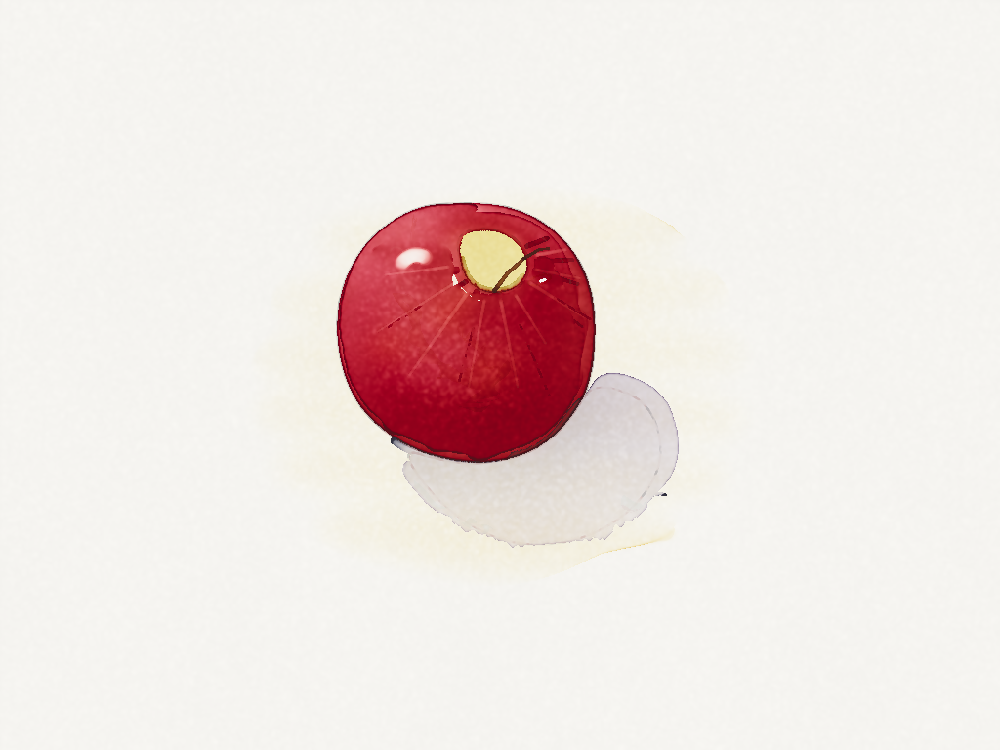
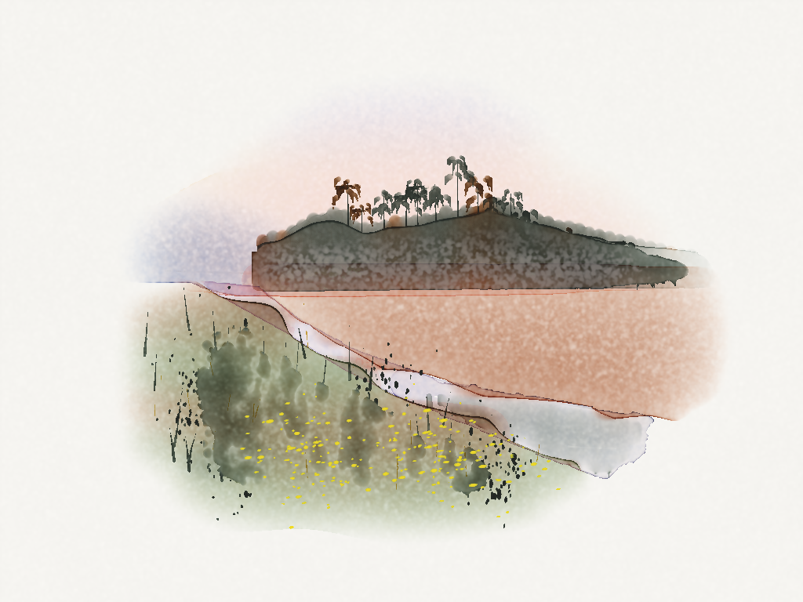

# Wet Edge

A physically based watercolour simulator that runs in the browser on the GPU, after Curtis et al., "Computer-Generated Watercolor" (SIGGRAPH 1997). Water flows over a textured sheet; it soaks into the fibres and dries through the paper's working stages: soaked, shiny, satin, moist, damp, dry. Pigment rides the water, settles into the grain, granulates or flocculates, stains or lifts, and is rendered spectrally (Kubelka–Munk over 16 bands), so mixtures and glazes behave like paint rather than like screen colours. Every law of the medium is a knob, including values no real paint would allow.




## Running

Needs a browser with WebGPU: a recent desktop Chrome or Edge, or Safari 26 or later. Serve the folder and open it:

```
python3 tools/serve.py        # no-cache dev server
# then open http://127.0.0.1:8765/
```

## Painting

- **Tools:** Paint; a Clean brush whose Wetness runs from laying water, through softening, to a thirsty brush that lifts; Mist; Spatter; Blot (a paper towel); Mask (masking fluid); Wash (fill an area: a lasso, a rectangle, a shape you click inside, or the whole sheet); Pencil and Eraser; magnets for magnetic pigments.
- **Brushes:** a synthetic round, a squirrel mop, a rigger, a flat, and a refillable water brush. Each has its own firmness: a soft mop glazes over dry paint without disturbing it, a firm flat scrubs it up.
- **Paper stages:** the stage under the cursor shows beside the title. *Skip ahead* fast-forwards the drying to a chosen stage; *Drying pace* slows it toward real time; *Blow-dry* hurries it (and changes how the pigment settles, as a real dryer does).
- **The paint box:** 23 pigments, each with its own staining, granulation, flocculation, opacity and colour (masstone and tint), all editable with *Edit pigment*. Mix up to four in a well.
- **History:** undo and redo are exact (every input to the simulation is logged and replayed). Paintings save and open with all their state; *Save bug report* captures a replayable session.

Keys are listed at the bottom of the panel.

## Scripts and agents

Everything a person can do from the page, a script can do through `window.__sim`, and `tools/paint.mjs` runs painting scripts in a private headless browser. [AGENTS.md](AGENTS.md) documents every tool, action and knob; `paintings/` holds painting scripts (by Claude models and GPT, painting alongside a human painter) and their results.

## Layout

- `src/shaders.js`: WGSL: shallow-water flow, transport, settling, capillary paper, binding and rewetting, spectral Kubelka–Munk render
- `src/params.js`, `src/knob-docs.js`: every knob, with a plain-language description
- `src/pigments.js`, `src/spectra-data.js`: the paint box and its spectra
- `src/paper.js`: procedural paper surfaces
- `src/actions.js`: every tool and action by name, shared by the page and scripts
- `src/minds.js`: "little minds": brushes that sense the paper as they work (washes, softening, waiting for a stage)
- `tools/measure.mjs`, `tools/probes.js`: calibration probes, run headless

## Measuring

```
npm install
npm run serve &
npm run measure                                # all probes
node tools/measure.mjs edge --set granulation=0  # one probe, with a knob override
```

## Credits

- The simulation follows C. J. Curtis, S. E. Anderson, J. E. Seims, K. W. Fleischer and D. H. Salesin, "Computer-Generated Watercolor" (SIGGRAPH 1997), extended in many directions.
- The paper's working stages follow Bruce MacEvoy's handprint.com notes on watercolour wetness.
- The pigment spectra in `src/spectra-data.js` are resampled (16 bands) from published reflectance measurements: Y. Okumura, *Developing a Spectral and Colorimetric Database of Artist Paint Materials* (RIT Munsell Color Science Laboratory, 2005); R. S. Berns, "Artist Paint Spectral Database" (IS&T Color and Imaging Conference, 2016); the Cultural Heritage Science Open Source *Pigments Checker* reflectance database; and the FOGRA51 characterization data. Colours were then fitted to reference swatches.

## Licence

The code is MIT; see [LICENSE](LICENSE). The paintings in `paintings/` (the images) are dedicated to the public domain under CC0; see [paintings/LICENSE.md](paintings/LICENSE.md).
